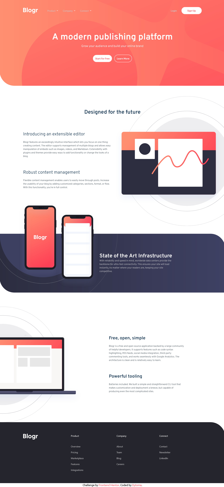

# Frontend Mentor - Blogr landing page solution

This is a solution to the [Blogr landing page challenge on Frontend Mentor](https://www.frontendmentor.io/challenges/blogr-landing-page-EX2RLAApP). Frontend Mentor challenges help you improve your coding skills by building realistic projects. 

## Table of contents

- [Overview](#overview)
  - [The challenge](#the-challenge)
  - [Screenshot](#screenshot)
  - [Links](#links)
  - [Built with](#built-with)
  - [What I learned](#what-i-learned)
  - [Continued development](#continued-development)
- [Author](#author)

## Overview

A solution to the Blog landing page challenge from Frontend Mentor.

### The challenge

Users should be able to:

- View the optimal layout for the site depending on their device's screen size
- See hover states for all interactive elements on the page

### Screenshot

This is a screenshot to my solution.

### Links

- Solution URL: [Add solution URL here](https://your-solution-url.com)
- Live Site URL: [Live site URL](https://github.com/Dytoma/blog-landing-page)

### Built with

- Semantic HTML5 markup
- CSS custom properties
- Flexbox
- CSS Grid
- Mobile-first workflow
- [Tailwindcss](https://tailwindcss.com/docs/installation) - CSS framework

### What I learned

I wanted to learn tailwindcss with this project and I definitely liked it. It helps you speed up in your work with build in classes but also difficult to debug with a lot of classes in your code.

### Continued development

I have to work more on JavaScript to improve my skills.

## Author

- Frontend Mentor - [@Dytoma](https://www.frontendmentor.io/profile/Dytoma)
- Twitter - [@OmarDytoma](https://www.twitter.com/OmarDytoma)

